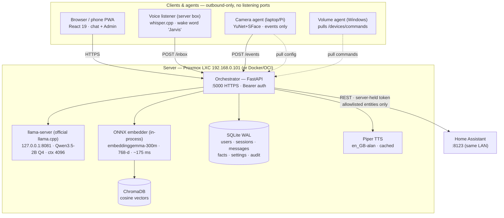
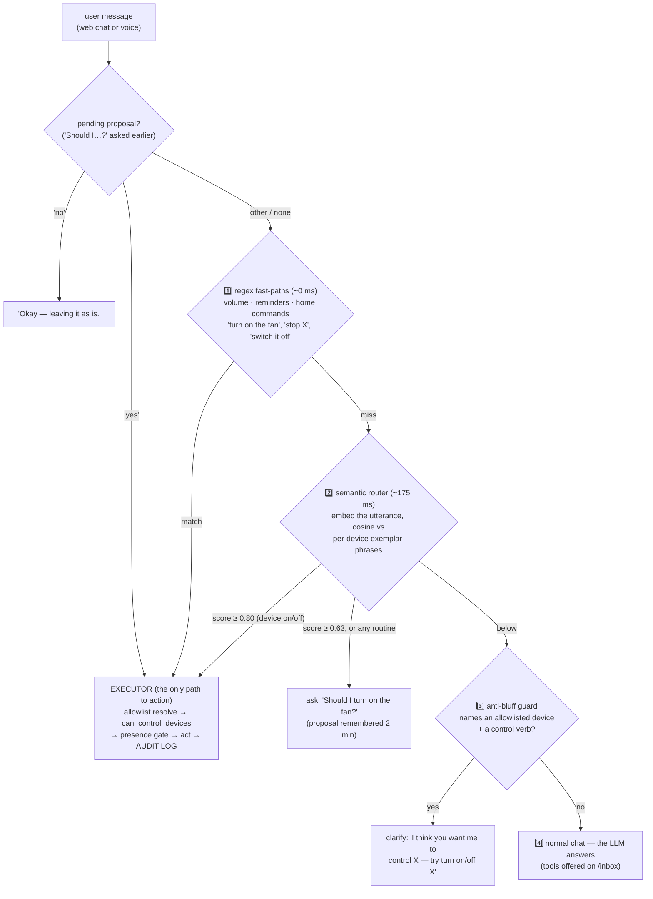
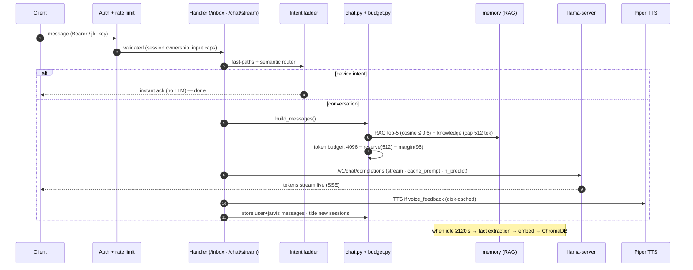
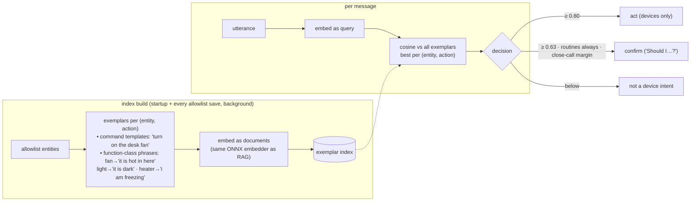
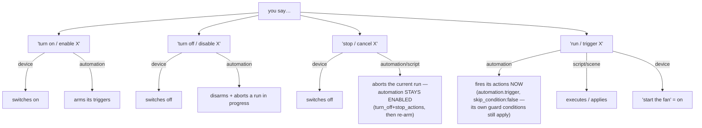
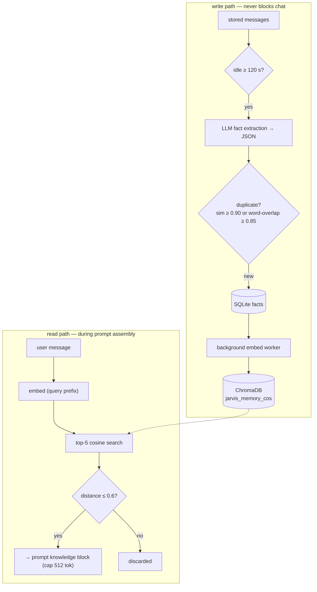
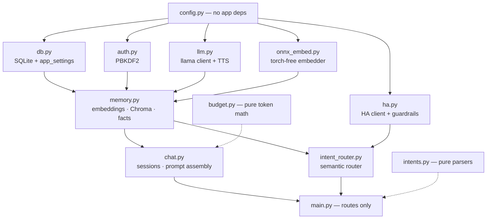
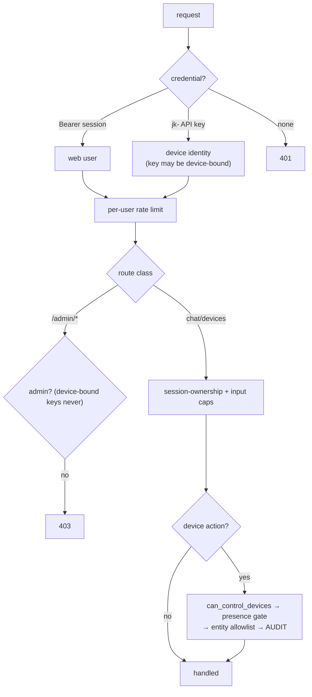
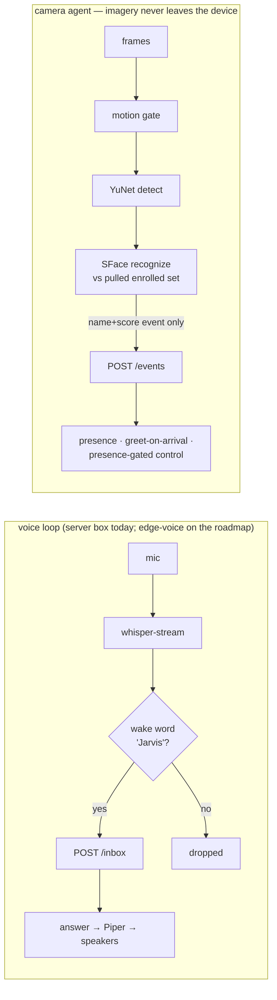
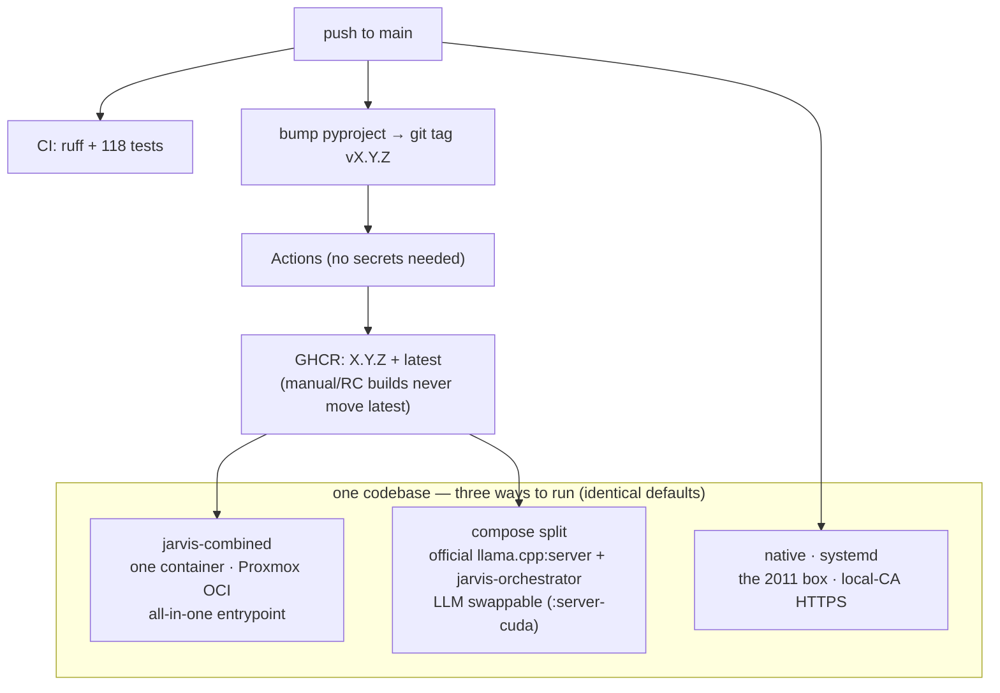

# Diagrams — every flow, visually

One page of flow diagrams for the whole system (GitHub renders these natively). Prose deep-dives:
[ARCHITECTURE.md](ARCHITECTURE.md) · [WORKFLOWS.md](WORKFLOWS.md) · [API.md](API.md). Current as of
**v2.6.0**.

---

## 1. Full system

Solid = inbound requests; dotted = agents pulling (they open **no** ports). The HA token never
leaves the server; the LLM never sees it.

---

## 2. The intent ladder — how a message becomes an action ⭐

The design rule: a device-shaped message can **never** reach the toolless streaming LLM (which
would invent an ack) — it either acts, asks, or clarifies. And *every* action funnels through one
executor with the same gates, no matter which layer proposed it.

---

## 3. Chat request lifecycle

---

## 4. Semantic router internals

Thresholds calibrated on the box against the real embedder: unrelated chat peaked at **0.627**,
true paraphrases spanned **0.656–0.829** — the confirm line (0.63) sits in the gap.

---

## 5. Home Assistant — verbs and what they really do

Every arrow passes: entity **allowlist** → `_can_control_devices` → presence gate → **audit log**.
Payloads to HA are hardcoded shapes (`entity_id` only) and responses are discarded — nothing for a
prompt injection to smuggle in either direction.

---

## 6. Memory / RAG

SQLite is the **source of truth** (chats, facts); ChromaDB is a rebuildable index
(`reembed_memory.py`). The embedder runs torch-free on ONNX — same vectors, verified cosine 1.0.

---

## 7. Module import graph (acyclic)

---

## 8. Auth & security gates

The LLM appears nowhere in this diagram — that's the point. Models propose; code decides.

---

## 9. Voice & vision

---

## 10. Deployment shapes & release pipeline

Supply chain: every download pinned + SHA-256-verified (LLM GGUF · ONNX embed bundle from the
project's own HF repo · Piper + voice · llama.cpp tag). **git tag = pyproject = image tags.**
