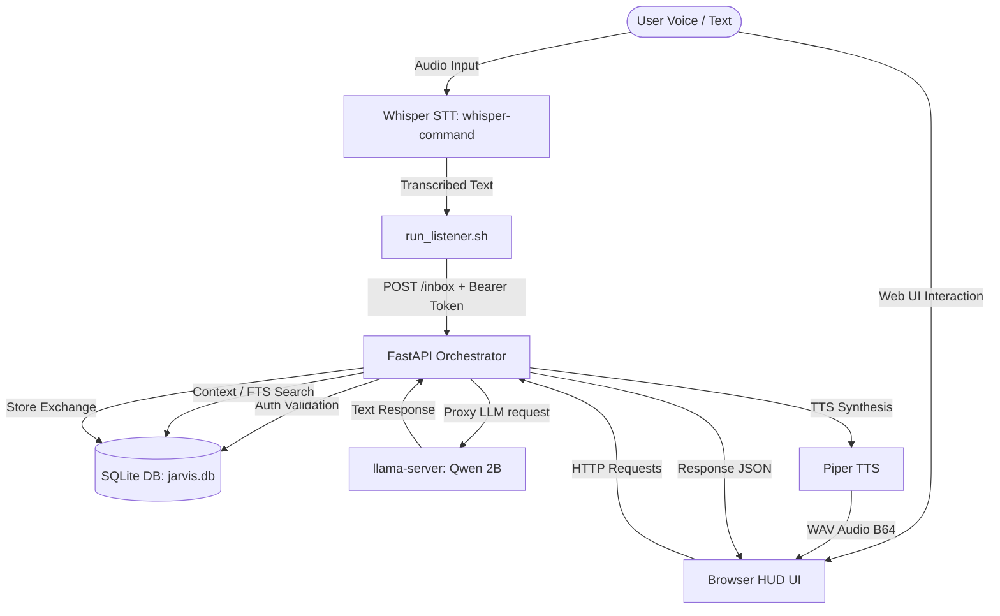

# JARVIS AI Assistant: Project Analysis & Diagnostic Report

This document provides a comprehensive structural, architectural, database, and configuration analysis of the JARVIS AI Assistant.

---

## 1. System Architecture

The project is structured as a self-hosted, offline-capable AI assistant running on limited hardware (i5-2520M, 8GB RAM) with local speech-to-text, LLM inference, memory caching, and text-to-speech pipelines.

---

## 2. Directory Layout & File Mappings

All source code and configurations have been consolidated under `/srv/jarvis`.

| Directory / File | Description | Role / Status |
| :--- | :--- | :--- |
| **`README.md`** | High-level user guide and quick start commands. | Documentation |
| **`docs/`** | Contains detailed logs, benchmarking, and architectural history. | Documentation |
| **`config/jarvis.json`** | Primary settings file containing credentials and server parameters. | Configuration |
| **`config/schema.sql`** | SQL definitions of memory tables and full-text search triggers. | DB Schema |
| **`memory/jarvis.db`** | Active SQLite database storage. | Runtime Memory |
| **`models/qwen3.5_2b/`** | Location of active Qwen3.5-2B GGUF brain. | Model Layer |
| **`piper/`** | Text-to-speech engine binaries and voices. | TTS Engine |
| **`whisper/`** | Speech-to-text compiled executable and base models. | STT Engine |
| **`src/orchestrator/main.py`** | Coordinates auth, routing, context, LLM, and Piper TTS. | Orchestrator (FastAPI) |
| **`src/orchestrator/static/`** | Frontend assets for Stark HUD (HTML, JS, CSS, Admin Panel). | Web GUI |
| **`src/scripts/`** | Operational scripts for starting listeners, TTS, and auth migrations. | Helpers |
| **`systemd/`** | Auto-start services for llama-fast and orchestrator. | Daemon Control |

---

## 3. Detailed Component Deep-Dive

### A. FastAPI Orchestrator (`src/orchestrator/main.py`)
- **Web UI & Admin Endpoints**: Serves files from `static/` folder (customized Stark HUD UI) and provides endpoints like `/admin/users`, `/admin/api_keys`, `/admin/stats`.
- **Security Middleware**: Intercepts requests to validate Bearer tokens.
  1. Checks if the Bearer token matches the `MASTER_API_KEY` for emergency bypass.
  2. Queries `auth_sessions` to validate user session validity (for Web UI logins).
  3. Queries `api_keys` to validate machine requests (e.g. scripts, Home Assistant).
- **LLM Endpoint Client**: Uses `urllib.request` to communicate with the local `llama-server` running at `127.0.0.1:8081/v1/chat/completions`.
- **Piper TTS Integration**: Converts response text to audio via a subprocess call running `piper --model ... --output_file -` and returns base64-encoded audio.

### B. SQLite Memory Database (`memory/jarvis.db`)
The schema enforces relationships between entities, including chat sessions and users:
- **Tables**:
  - `users`: Contains `id`, `username`, `password_hash`, and `role`.
  - `auth_sessions`: Web interface tokens with expirations.
  - `api_keys`: Machine tokens with usage analytics.
  - `chat_sessions`: Chat metadata. Crucially, it maps to a user via a `user_id` column.
  - `conversation_history`: Logs of speaker and content.
  - `conversation_fts`: Virtual FTS5 table automatically synchronized via triggers.
  - `semantic_facts`: Extracted knowledge topic/fact pairs.

> [!WARNING]
> **Database Foreign Key Hazard**
> In [main.py](file:///srv/jarvis/src/orchestrator/main.py#L126-L131), when the `MASTER_API_KEY` is matched as an emergency bypass, the server sets `request.state.user_id = 1` and marks `request.state.is_admin = True`.
> However, if [migrate_auth.py](file:///srv/jarvis/src/scripts/migrate_auth.py) has NOT been run to populate the `users` table with at least one record (specifically, the default admin user with `id = 1`), then attempting to create a new session via `/sessions` will trigger a foreign key constraint violation on `chat_sessions.user_id` pointing to `users.id`.
> 
> Running `/srv/jarvis/src/scripts/migrate_auth.py` is **mandatory** to seed this user and prevent runtime failures.

### C. Speech-to-Text (`whisper/`)
- Compiled with `GGML_AVX=ON` and `WHISPER_SDL2=ON` for optimal CPU utilization on the older Sandy Bridge processor.
- Uses `base.en` model (142MB), which processes real-time voice inputs ~4.4x faster than `small.en` on this system.
- `run_listener.sh` starts `whisper-command` to record inputs following the wake phrase "Jarvis" and pipes transcriptions to `/inbox` using curls authenticated via the system API key.

### D. Text-to-Speech (`piper/`)
- Integrates Rhasspy's Piper engine.
- Voice model: `en_GB-alan-medium.onnx` (Alan British Male).
- Operates offline and generates voice files dynamically with sub-second latencies on CPU.

### E. Frontend (`src/orchestrator/static/`)
- **Visual Aesthetic**: Tailored Iron Man HUD styling with animated scanlines, radial arc reactors, custom HSL variables, and dark colors.
- **XSS Safety**: Explicitly avoids `innerHTML` writes, relying strictly on safe methods (`textContent`, `createElement`, and `replaceChildren`) to parse incoming LLM responses.
- **Configuration Panel**: Exposes all Qwen parameter adjustments directly to the client (temperature, top-k, top-p, min-p, repeat penalty, presence penalty, frequency penalty, custom system prompt overrides).

---

## 4. Performance & Hardware Constraints Analysis

Since the hosting container is capped on Sandy Bridge architecture (AVX instruction set present; **AVX2 and FMA are absent**), optimization is heavily enforced:
1. **Llama Server Optimizations**:
   - Running the lightweight **Qwen3.5-2B** quantized model rather than the heavier 4B model.
   - Using `--reasoning off` to disable long chain-of-thought processing. This decreases latency from 60+ seconds to 5-15 seconds.
   - Capped contexts at **1024 tokens** and thread execution at **2 threads** to optimize performance without saturating CPU threads.
2. **Whisper STT**:
   - Model capped at `base.en`. `small.en` requires 364 seconds per transcription compared to `base.en`'s 83.5 seconds.
3. **Container Swappiness**:
   - Recommended settings include setting host swappiness `vm.swappiness=10` to limit OS memory swaps for maximum runtime RAM availability.

---

## 5. Security Posture Summary

The architecture adopts several defense-in-depth security principles:
1. **Zero Cloud Dependencies**: All services, files, database tables, and intelligence layers reside entirely local.
2. **Network Isolation**: `llama-server` is configured to listen strictly to `127.0.0.1:8081`. It cannot be directly queried from the external network, securing the inference API behind the FastAPI authorization handler.
3. **Access Controls**:
   - FastAPI middleware mandates Bearer tokens on all APIs except the public `/health` query.
   - Multi-role clearance sets apart standard users (rate-limited, max input 500 characters) and administrators (bypassed limits, max input 10,000 characters).
4. **Resiliency & Defense**:
   - Rate limiting: Max 30 requests/minute per client IP.
   - Parameterized SQL: Prevents SQL injections.
   - Safe CSS & JS Frontend: Sanitizes user inputs.
